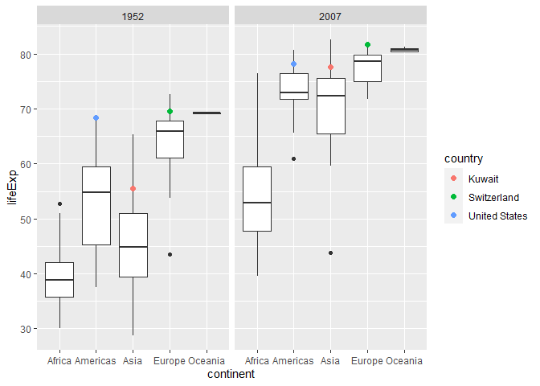

Gapminder
================
Drew Pang
2023-02-26

- [Grading Rubric](#grading-rubric)
  - [Individual](#individual)
  - [Due Date](#due-date)
- [Guided EDA](#guided-eda)
  - [**q0** Perform your “first checks” on the dataset. What variables
    are in
    this](#q0-perform-your-first-checks-on-the-dataset-what-variables-are-in-this)
  - [**q1** Determine the most and least recent years in the `gapminder`
    dataset.](#q1-determine-the-most-and-least-recent-years-in-the-gapminder-dataset)
  - [**q2** Filter on years matching `year_min`, and make a plot of the
    GDP per capita against continent. Choose an appropriate `geom_` to
    visualize the data. What observations can you
    make?](#q2-filter-on-years-matching-year_min-and-make-a-plot-of-the-gdp-per-capita-against-continent-choose-an-appropriate-geom_-to-visualize-the-data-what-observations-can-you-make)
  - [**q3** You should have found *at least* three outliers in q2 (but
    possibly many more!). Identify those outliers (figure out which
    countries they
    are).](#q3-you-should-have-found-at-least-three-outliers-in-q2-but-possibly-many-more-identify-those-outliers-figure-out-which-countries-they-are)
  - [**q4** Create a plot similar to yours from q2 studying both
    `year_min` and `year_max`. Find a way to highlight the outliers from
    q3 on your plot *in a way that lets you identify which country is
    which*. Compare the patterns between `year_min` and
    `year_max`.](#q4-create-a-plot-similar-to-yours-from-q2-studying-both-year_min-and-year_max-find-a-way-to-highlight-the-outliers-from-q3-on-your-plot-in-a-way-that-lets-you-identify-which-country-is-which-compare-the-patterns-between-year_min-and-year_max)
- [Your Own EDA](#your-own-eda)
  - [**q5** Create *at least* three new figures below. With each figure,
    try to pose new questions about the
    data.](#q5-create-at-least-three-new-figures-below-with-each-figure-try-to-pose-new-questions-about-the-data)

*Purpose*: Learning to do EDA well takes practice! In this challenge
you’ll further practice EDA by first completing a guided exploration,
then by conducting your own investigation. This challenge will also give
you a chance to use the wide variety of visual tools we’ve been
learning.

<!-- include-rubric -->

# Grading Rubric

<!-- -------------------------------------------------- -->

Unlike exercises, **challenges will be graded**. The following rubrics
define how you will be graded, both on an individual and team basis.

## Individual

<!-- ------------------------- -->

| Category    | Needs Improvement                                                                                                | Satisfactory                                                                                                               |
|-------------|------------------------------------------------------------------------------------------------------------------|----------------------------------------------------------------------------------------------------------------------------|
| Effort      | Some task **q**’s left unattempted                                                                               | All task **q**’s attempted                                                                                                 |
| Observed    | Did not document observations, or observations incorrect                                                         | Documented correct observations based on analysis                                                                          |
| Supported   | Some observations not clearly supported by analysis                                                              | All observations clearly supported by analysis (table, graph, etc.)                                                        |
| Assessed    | Observations include claims not supported by the data, or reflect a level of certainty not warranted by the data | Observations are appropriately qualified by the quality & relevance of the data and (in)conclusiveness of the support      |
| Specified   | Uses the phrase “more data are necessary” without clarification                                                  | Any statement that “more data are necessary” specifies which *specific* data are needed to answer what *specific* question |
| Code Styled | Violations of the [style guide](https://style.tidyverse.org/) hinder readability                                 | Code sufficiently close to the [style guide](https://style.tidyverse.org/)                                                 |

## Due Date

<!-- ------------------------- -->

All the deliverables stated in the rubrics above are due **at midnight**
before the day of the class discussion of the challenge. See the
[Syllabus](https://docs.google.com/document/d/1qeP6DUS8Djq_A0HMllMqsSqX3a9dbcx1/edit?usp=sharing&ouid=110386251748498665069&rtpof=true&sd=true)
for more information.

``` r
library(tidyverse)
```

    ## ── Attaching packages ─────────────────────────────────────── tidyverse 1.3.2 ──
    ## ✔ ggplot2 3.4.0      ✔ purrr   1.0.1 
    ## ✔ tibble  3.1.8      ✔ dplyr   1.0.10
    ## ✔ tidyr   1.2.1      ✔ stringr 1.5.0 
    ## ✔ readr   2.1.3      ✔ forcats 0.5.2 
    ## ── Conflicts ────────────────────────────────────────── tidyverse_conflicts() ──
    ## ✖ dplyr::filter() masks stats::filter()
    ## ✖ dplyr::lag()    masks stats::lag()

``` r
library(gapminder)
```

*Background*: [Gapminder](https://www.gapminder.org/about-gapminder/) is
an independent organization that seeks to educate people about the state
of the world. They seek to counteract the worldview constructed by a
hype-driven media cycle, and promote a “fact-based worldview” by
focusing on data. The dataset we’ll study in this challenge is from
Gapminder.

# Guided EDA

<!-- -------------------------------------------------- -->

First, we’ll go through a round of *guided EDA*. Try to pay attention to
the high-level process we’re going through—after this guided round
you’ll be responsible for doing another cycle of EDA on your own!

### **q0** Perform your “first checks” on the dataset. What variables are in this

dataset?

``` r
glimpse(gapminder)
```

    ## Rows: 1,704
    ## Columns: 6
    ## $ country   <fct> "Afghanistan", "Afghanistan", "Afghanistan", "Afghanistan", …
    ## $ continent <fct> Asia, Asia, Asia, Asia, Asia, Asia, Asia, Asia, Asia, Asia, …
    ## $ year      <int> 1952, 1957, 1962, 1967, 1972, 1977, 1982, 1987, 1992, 1997, …
    ## $ lifeExp   <dbl> 28.801, 30.332, 31.997, 34.020, 36.088, 38.438, 39.854, 40.8…
    ## $ pop       <int> 8425333, 9240934, 10267083, 11537966, 13079460, 14880372, 12…
    ## $ gdpPercap <dbl> 779.4453, 820.8530, 853.1007, 836.1971, 739.9811, 786.1134, …

**Observations**:

- Variables:
  - country

  - continent

  - year

  - lifeExp

  - pop

  - gdpPercap

### **q1** Determine the most and least recent years in the `gapminder` dataset.

*Hint*: Use the `pull()` function to get a vector out of a tibble.
(Rather than the `$` notation of base R.)

``` r
## TASK: Find the largest and smallest values of `year` in `gapminder`
year_max <- max(pull(gapminder, year))
year_min <- min(pull(gapminder, year))
```

Use the following test to check your work.

``` r
## NOTE: No need to change this
assertthat::assert_that(year_max %% 7 == 5)
```

    ## [1] TRUE

``` r
assertthat::assert_that(year_max %% 3 == 0)
```

    ## [1] TRUE

``` r
assertthat::assert_that(year_min %% 7 == 6)
```

    ## [1] TRUE

``` r
assertthat::assert_that(year_min %% 3 == 2)
```

    ## [1] TRUE

``` r
if (is_tibble(year_max)) {
  print("year_max is a tibble; try using `pull()` to get a vector")
  assertthat::assert_that(False)
}

print("Nice!")
```

    ## [1] "Nice!"

### **q2** Filter on years matching `year_min`, and make a plot of the GDP per capita against continent. Choose an appropriate `geom_` to visualize the data. What observations can you make?

You may encounter difficulties in visualizing these data; if so document
your challenges and attempt to produce the most informative visual you
can.

``` r
## TASK: Create a visual of gdpPercap vs continent
gapminder %>%
  filter(year == year_min) %>%
  ggplot(aes(x = gdpPercap, y = continent)) + 
  geom_boxplot() + 
  coord_flip()
```

<!-- -->

``` r
gapminder %>%
  filter(year == year_min & gdpPercap < 30000) %>%
  ggplot(aes(x = gdpPercap, y = continent)) + 
  geom_boxplot() + 
  coord_flip()
```

<!-- -->

**Observations**:

- Oceania has the highest median `gdpPercap`, but closest quantiles,
  suggesting that there is a small sample size.

- Median `gdpPercap` from highest to lower for continents is Oceania,
  Europe, Americas, Asia, Africa.

- Europe has the greatest range without the very large outlier in Asia,
  and Oceania has the smallest range.

- Europe has the largest box - or the largest range between the 25th and
  75th percentiles.

**Difficulties & Approaches**:

- My first thought was to create a boxplot, because we are plotting a
  continuous variable against a discrete variable. However, upon
  creating a simple boxplot, one of the outliers extends the scale of
  gdpPercap enough that it squishes all of the boxes towards the bottom
  quarter of the plot.
- I simply added another filter to filter out gdpPercap values
  above 30000. Not sure what the correct way to go about removing
  outliers for the sake of graph visibility, but it made reading the box
  plot a lot easier.

### **q3** You should have found *at least* three outliers in q2 (but possibly many more!). Identify those outliers (figure out which countries they are).

``` r
## TASK: Identify the outliers from q2
gapminder %>%
  filter(year == year_min) %>%
  arrange(desc(gdpPercap))
```

    ## # A tibble: 142 × 6
    ##    country        continent  year lifeExp       pop gdpPercap
    ##    <fct>          <fct>     <int>   <dbl>     <int>     <dbl>
    ##  1 Kuwait         Asia       1952    55.6    160000   108382.
    ##  2 Switzerland    Europe     1952    69.6   4815000    14734.
    ##  3 United States  Americas   1952    68.4 157553000    13990.
    ##  4 Canada         Americas   1952    68.8  14785584    11367.
    ##  5 New Zealand    Oceania    1952    69.4   1994794    10557.
    ##  6 Norway         Europe     1952    72.7   3327728    10095.
    ##  7 Australia      Oceania    1952    69.1   8691212    10040.
    ##  8 United Kingdom Europe     1952    69.2  50430000     9980.
    ##  9 Bahrain        Asia       1952    50.9    120447     9867.
    ## 10 Denmark        Europe     1952    70.8   4334000     9692.
    ## # … with 132 more rows

**Observations**:

- Identify the outlier countries from q2
  - There are no outliers with lower than median GDP per capita, so I
    sorted the data in ascending order based on `gdpPercap`.
  - The top three are Kuwait, Switzerland, and the United States.

*Hint*: For the next task, it’s helpful to know a ggplot trick we’ll
learn in an upcoming exercise: You can use the `data` argument inside
any `geom_*` to modify the data that will be plotted *by that geom
only*. For instance, you can use this trick to filter a set of points to
label:

``` r
## NOTE: No need to edit, use ideas from this in q4 below
gapminder %>%
  filter(year == max(year)) %>%

  ggplot(aes(continent, lifeExp)) +
  geom_boxplot() +
  geom_point(
    data = . %>% filter(country %in% c("United Kingdom", "Japan", "Zambia")),
    mapping = aes(color = country),
    size = 2
  )
```

<!-- -->

### **q4** Create a plot similar to yours from q2 studying both `year_min` and `year_max`. Find a way to highlight the outliers from q3 on your plot *in a way that lets you identify which country is which*. Compare the patterns between `year_min` and `year_max`.

*Hint*: We’ve learned a lot of different ways to show multiple
variables; think about using different aesthetics or facets.

``` r
## TASK: Create a visual of gdpPercap vs continent
gapminder %>%
  filter(year == year_min | year == year_max) %>%
  ggplot(aes(x = gdpPercap, y = continent)) + 
  geom_boxplot() + 
  coord_flip() + 
  facet_wrap(vars(year)) + 
  geom_point(
    data = . %>% filter(country %in% c("Kuwait", "Switzerland", "United States")),
    mapping = aes(color = country),
    size = 2
  )
```

<!-- -->

**Observations**:

- All three outliers from 1952 are still all above the median for their
  respective continents.
- Kuwait is no longer as far away from the median GDP per capita for
  Asia as is was in 1952 in 2007, but still appears to be one of the
  highest, if not the highest in Asia.
- The United States appears to have the highest GDP per capita in the
  Americas.
- It’s possible World War 2 and oil had to do with Kuwait’s very large
  `gdpPercap` in 1952. More research is necessary to determine the root
  cause.

# Your Own EDA

<!-- -------------------------------------------------- -->

Now it’s your turn! We just went through guided EDA considering the GDP
per capita at two time points. You can continue looking at outliers,
consider different years, repeat the exercise with `lifeExp`, consider
the relationship between variables, or something else entirely.

### **q5** Create *at least* three new figures below. With each figure, try to pose new questions about the data.

``` r
## TASK: Your first graph
gapminder %>%
  filter(year == year_min | year == year_max) %>%
  ggplot(aes(x = lifeExp, y = continent)) + 
  geom_boxplot() + 
  coord_flip() + 
  facet_wrap(vars(year)) + 
  geom_point(
    data = . %>% filter(country %in% c("Kuwait", "Switzerland", "United States")),
    mapping = aes(color = country),
    size = 2
  )
```

<!-- -->

- Across the board, life expectancy has gone up in all continents.
- Despite Kuwait’s very large GDP per capita, their life expectancy is
  not the highest in the world, let alone just in Asia.
- The Americas have the largest range for life expectancy in 1952, while
  Africa has the largest range in 2007. It is possible that there is a
  large development disparity in Africa.

``` r
## TASK: Your second graph
gapminder %>%
  filter(year == year_max) %>%
  arrange(desc(lifeExp))
```

    ## # A tibble: 142 × 6
    ##    country          continent  year lifeExp       pop gdpPercap
    ##    <fct>            <fct>     <int>   <dbl>     <int>     <dbl>
    ##  1 Japan            Asia       2007    82.6 127467972    31656.
    ##  2 Hong Kong, China Asia       2007    82.2   6980412    39725.
    ##  3 Iceland          Europe     2007    81.8    301931    36181.
    ##  4 Switzerland      Europe     2007    81.7   7554661    37506.
    ##  5 Australia        Oceania    2007    81.2  20434176    34435.
    ##  6 Spain            Europe     2007    80.9  40448191    28821.
    ##  7 Sweden           Europe     2007    80.9   9031088    33860.
    ##  8 Israel           Asia       2007    80.7   6426679    25523.
    ##  9 France           Europe     2007    80.7  61083916    30470.
    ## 10 Canada           Americas   2007    80.7  33390141    36319.
    ## # … with 132 more rows

``` r
gapminder %>%
  filter(country == "Japan" | country == "Hong Kong, (China)" | country == "Iceland" | country == "Switzerland" | country == "United States") %>%
  ggplot(aes(x = year, y = lifeExp, color = country)) + 
  geom_line()
```

<!-- -->

- I first filtered for the max year observations, then looked at the top
  countries for life expectancy. I pulled the top three along with the
  United States as a refrence.
- Life expectancy in these four countries goes up a noticeable amount. I
  though it would be a lot less, but a 10 year life expectancy increase
  in all countries is quite an improvement in just 50 years.

``` r
## TASK: Your third graph
gapminder %>%
  filter((year == year_min | year == year_max) & pop < 5e8) %>%
  ggplot(aes(x = pop, y = continent)) + 
  geom_boxplot() + 
  coord_flip() + 
  facet_wrap(vars(year)) + 
  geom_point(
    data = . %>% filter(country %in% c("Kuwait", "Switzerland", "United States")),
    mapping = aes(color = country),
    size = 2
  )
```

<!-- -->

- In general, the world population goes up. Asia in particular has a
  much larger range between the 25th and 75th percentiles.
- The United States remained
