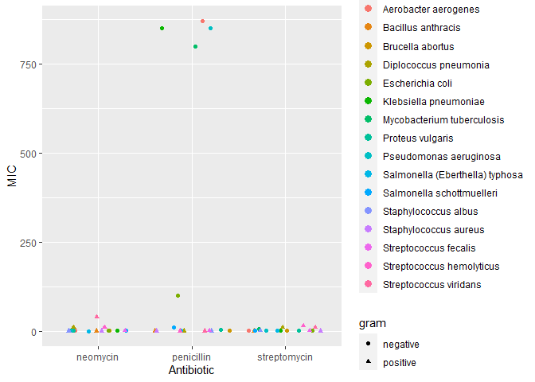
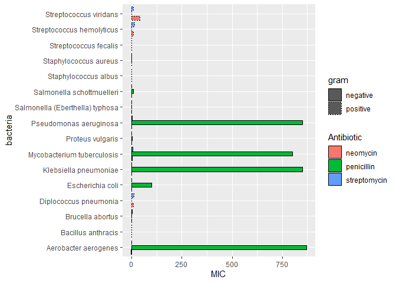
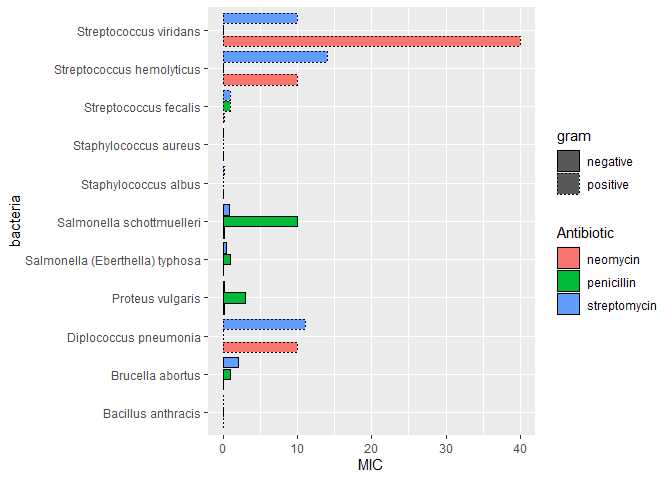
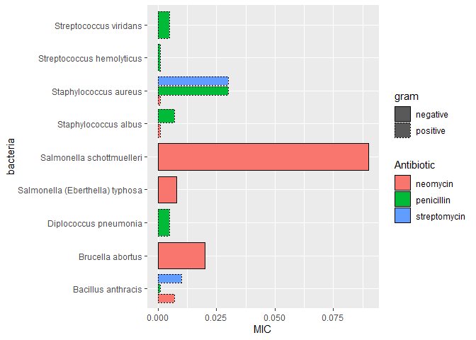
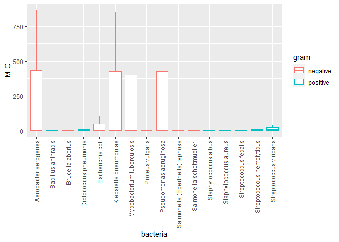
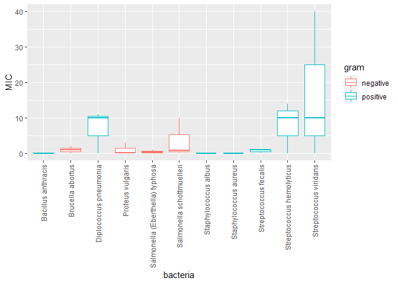
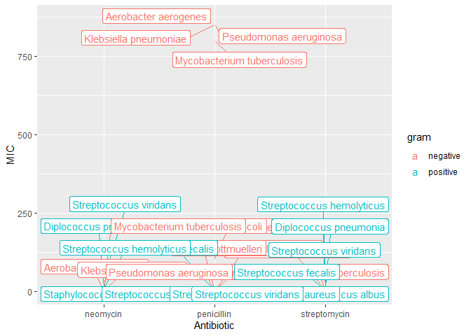
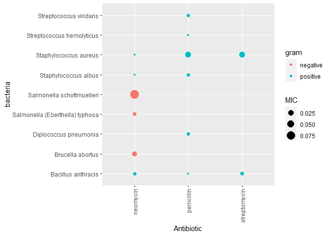

Antibiotics
================
Drew Pang
2020-3-5

*Purpose*: Creating effective data visualizations is an *iterative*
process; very rarely will the first graph you make be the most
effective. The most effective thing you can do to be successful in this
iterative process is to *try multiple graphs* of the same data.

Furthermore, judging the effectiveness of a visual is completely
dependent on *the question you are trying to answer*. A visual that is
totally ineffective for one question may be perfect for answering a
different question.

In this challenge, you will practice *iterating* on data visualization,
and will anchor the *assessment* of your visuals using two different
questions.

*Note*: Please complete your initial visual design **alone**. Work on
both of your graphs alone, and save a version to your repo *before*
coming together with your team. This way you can all bring a diversity
of ideas to the table!

<!-- include-rubric -->

# Grading Rubric

<!-- -------------------------------------------------- -->

Unlike exercises, **challenges will be graded**. The following rubrics
define how you will be graded, both on an individual and team basis.

## Individual

<!-- ------------------------- -->

| Category    | Needs Improvement                                                                                                | Satisfactory                                                                                                               |
|-------------|------------------------------------------------------------------------------------------------------------------|----------------------------------------------------------------------------------------------------------------------------|
| Effort      | Some task **q**’s left unattempted                                                                               | All task **q**’s attempted                                                                                                 |
| Observed    | Did not document observations, or observations incorrect                                                         | Documented correct observations based on analysis                                                                          |
| Supported   | Some observations not clearly supported by analysis                                                              | All observations clearly supported by analysis (table, graph, etc.)                                                        |
| Assessed    | Observations include claims not supported by the data, or reflect a level of certainty not warranted by the data | Observations are appropriately qualified by the quality & relevance of the data and (in)conclusiveness of the support      |
| Specified   | Uses the phrase “more data are necessary” without clarification                                                  | Any statement that “more data are necessary” specifies which *specific* data are needed to answer what *specific* question |
| Code Styled | Violations of the [style guide](https://style.tidyverse.org/) hinder readability                                 | Code sufficiently close to the [style guide](https://style.tidyverse.org/)                                                 |

## Due Date

<!-- ------------------------- -->

All the deliverables stated in the rubrics above are due **at midnight**
before the day of the class discussion of the challenge. See the
[Syllabus](https://docs.google.com/document/d/1qeP6DUS8Djq_A0HMllMqsSqX3a9dbcx1/edit?usp=sharing&ouid=110386251748498665069&rtpof=true&sd=true)
for more information.

``` r
library(tidyverse)
```

    ## ── Attaching packages ─────────────────────────────────────── tidyverse 1.3.2 ──
    ## ✔ ggplot2 3.4.0      ✔ purrr   1.0.1 
    ## ✔ tibble  3.1.8      ✔ dplyr   1.0.10
    ## ✔ tidyr   1.2.1      ✔ stringr 1.5.0 
    ## ✔ readr   2.1.3      ✔ forcats 0.5.2 
    ## ── Conflicts ────────────────────────────────────────── tidyverse_conflicts() ──
    ## ✖ dplyr::filter() masks stats::filter()
    ## ✖ dplyr::lag()    masks stats::lag()

``` r
library(ggrepel)
```

*Background*: The data\[1\] we study in this challenge report the
[*minimum inhibitory
concentration*](https://en.wikipedia.org/wiki/Minimum_inhibitory_concentration)
(MIC) of three drugs for different bacteria. The smaller the MIC for a
given drug and bacteria pair, the more practical the drug is for
treating that particular bacteria. An MIC value of *at most* 0.1 is
considered necessary for treating human patients.

These data report MIC values for three antibiotics—penicillin,
streptomycin, and neomycin—on 16 bacteria. Bacteria are categorized into
a genus based on a number of features, including their resistance to
antibiotics.

``` r
## NOTE: If you extracted all challenges to the same location,
## you shouldn't have to change this filename
filename <- "./data/antibiotics.csv"

## Load the data
df_antibiotics <- read_csv(filename)
```

    ## Rows: 16 Columns: 5
    ## ── Column specification ────────────────────────────────────────────────────────
    ## Delimiter: ","
    ## chr (2): bacteria, gram
    ## dbl (3): penicillin, streptomycin, neomycin
    ## 
    ## ℹ Use `spec()` to retrieve the full column specification for this data.
    ## ℹ Specify the column types or set `show_col_types = FALSE` to quiet this message.

``` r
df_antibiotics # %>% knitr::kable()
```

    ## # A tibble: 16 × 5
    ##    bacteria                        penicillin streptomycin neomycin gram    
    ##    <chr>                                <dbl>        <dbl>    <dbl> <chr>   
    ##  1 Aerobacter aerogenes               870             1       1.6   negative
    ##  2 Brucella abortus                     1             2       0.02  negative
    ##  3 Bacillus anthracis                   0.001         0.01    0.007 positive
    ##  4 Diplococcus pneumonia                0.005        11      10     positive
    ##  5 Escherichia coli                   100             0.4     0.1   negative
    ##  6 Klebsiella pneumoniae              850             1.2     1     negative
    ##  7 Mycobacterium tuberculosis         800             5       2     negative
    ##  8 Proteus vulgaris                     3             0.1     0.1   negative
    ##  9 Pseudomonas aeruginosa             850             2       0.4   negative
    ## 10 Salmonella (Eberthella) typhosa      1             0.4     0.008 negative
    ## 11 Salmonella schottmuelleri           10             0.8     0.09  negative
    ## 12 Staphylococcus albus                 0.007         0.1     0.001 positive
    ## 13 Staphylococcus aureus                0.03          0.03    0.001 positive
    ## 14 Streptococcus fecalis                1             1       0.1   positive
    ## 15 Streptococcus hemolyticus            0.001        14      10     positive
    ## 16 Streptococcus viridans               0.005        10      40     positive

# Visualization

<!-- -------------------------------------------------- -->

### **q1** Prototype 5 visuals

To start, construct **5 qualitatively different visualizations of the
data** `df_antibiotics`. These **cannot** be simple variations on the
same graph; for instance, if two of your visuals could be made identical
by calling `coord_flip()`, then these are *not* qualitatively different.

For all five of the visuals, you must show information on *all 16
bacteria*. For the first two visuals, you must *show all variables*.

*Hint 1*: Try working quickly on this part; come up with a bunch of
ideas, and don’t fixate on any one idea for too long. You will have a
chance to refine later in this challenge.

*Hint 2*: The data `df_antibiotics` are in a *wide* format; it may be
helpful to `pivot_longer()` the data to make certain visuals easier to
construct.

#### Visual 1 (All variables)

In this visual you must show *all three* effectiveness values for *all
16 bacteria*. You must also show whether or not each bacterium is Gram
positive or negative.

``` r
# Pivot data longer for future graphs
df_antibiotics_longer <- df_antibiotics %>% 
  pivot_longer(
    names_to = "Antibiotic",
    values_to = "MIC",
    c(penicillin:neomycin)
  )
df_antibiotics_longer
```

    ## # A tibble: 48 × 4
    ##    bacteria              gram     Antibiotic       MIC
    ##    <chr>                 <chr>    <chr>          <dbl>
    ##  1 Aerobacter aerogenes  negative penicillin   870    
    ##  2 Aerobacter aerogenes  negative streptomycin   1    
    ##  3 Aerobacter aerogenes  negative neomycin       1.6  
    ##  4 Brucella abortus      negative penicillin     1    
    ##  5 Brucella abortus      negative streptomycin   2    
    ##  6 Brucella abortus      negative neomycin       0.02 
    ##  7 Bacillus anthracis    positive penicillin     0.001
    ##  8 Bacillus anthracis    positive streptomycin   0.01 
    ##  9 Bacillus anthracis    positive neomycin       0.007
    ## 10 Diplococcus pneumonia positive penicillin     0.005
    ## # … with 38 more rows

``` r
df_antibiotics_longer %>%
  ggplot(aes(y = MIC, x = Antibiotic), height = 0) +
  geom_jitter(aes(color = bacteria, shape = gram)) +
  guides(color = guide_legend(override.aes = list(size = 3)))
```

<!-- -->

``` r
  # theme(legend.position="bottom") + 
  # guides(color = guide_legend(nrow = 6, byrow=TRUE))
```

#### Visual 2 (All variables)

In this visual you must show *all three* effectiveness values for *all
16 bacteria*. You must also show whether or not each bacterium is Gram
positive or negative.

Note that your visual must be *qualitatively different* from *all* of
your other visuals.

``` r
df_antibiotics_longer %>%
  ggplot(aes(x = MIC, y = bacteria)) +
  geom_col(aes(fill = Antibiotic, linetype = gram), position = "dodge2", color = "black")
```

<!-- -->

``` r
df_antibiotics_longer %>%
   filter(bacteria != "Aerobacter aerogenes" & bacteria != "Klebsiella pneumoniae" & bacteria != "Mycobacterium tuberculosis" & bacteria != "Pseudomonas aeruginosa" & bacteria != "Escherichia coli") %>%
  ggplot(aes(x = MIC, y = bacteria)) +
  geom_col(aes(fill = Antibiotic, linetype = gram), position = "dodge2", color = "black")
```

<!-- -->

``` r
df_antibiotics_longer %>%
   filter(MIC < 0.1 ) %>%
  ggplot(aes(x = MIC, y = bacteria)) +
  geom_col(aes(fill = Antibiotic, linetype = gram), position = "dodge2", color = "black")
```

<!-- -->

#### Visual 3 (Some variables)

In this visual you may show a *subset* of the variables (`penicillin`,
`streptomycin`, `neomycin`, `gram`), but you must still show *all 16
bacteria*.

Note that your visual must be *qualitatively different* from *all* of
your other visuals.

``` r
df_antibiotics_longer %>%
  ggplot(aes(bacteria, MIC)) +
  geom_boxplot(aes(color = gram)) +
  theme(axis.text.x = element_text(angle = 90, vjust = 0.5, hjust=1))
```

<!-- -->

``` r
# Filter out very large boxes
df_antibiotics_longer %>%
  filter(bacteria != "Aerobacter aerogenes" & bacteria != "Klebsiella pneumoniae" & bacteria != "Mycobacterium tuberculosis" & bacteria != "Pseudomonas aeruginosa" & bacteria != "Escherichia coli") %>%
  ggplot(aes(bacteria, MIC)) +
  geom_boxplot(aes(color = gram)) +
  theme(axis.text.x = element_text(angle = 90, vjust = 0.5, hjust=1))
```

<!-- -->

#### Visual 4 (Some variables)

In this visual you may show a *subset* of the variables (`penicillin`,
`streptomycin`, `neomycin`, `gram`), but you must still show *all 16
bacteria*.

Note that your visual must be *qualitatively different* from *all* of
your other visuals.

``` r
# Quite a bad plot if I do say so myself
df_antibiotics_longer %>%
  ggplot(aes(y = MIC, x = Antibiotic, color = gram)) +
  geom_label_repel(aes(label = bacteria), max.overlaps=Inf)
```

<!-- -->

#### Visual 5 (Some variables)

In this visual you may show a *subset* of the variables (`penicillin`,
`streptomycin`, `neomycin`, `gram`), but you must still show *all 16
bacteria*.

Note that your visual must be *qualitatively different* from *all* of
your other visuals.

``` r
df_antibiotics_longer %>%
  filter(MIC < 0.1 ) %>%
  ggplot(aes(bacteria, Antibiotic, color = gram)) +
  geom_point(aes(size = MIC)) +
  theme(axis.text.x = element_text(angle = 90, vjust = 0.5, hjust=1)) +
  coord_flip()
```

<!-- -->

### **q2** Assess your visuals

There are **two questions** below; use your five visuals to help answer
both Guiding Questions. Note that you must also identify which of your
five visuals were most helpful in answering the questions.

*Hint 1*: It’s possible that *none* of your visuals is effective in
answering the questions below. You may need to revise one or more of
your visuals to answer the questions below!

*Hint 2*: It’s **highly unlikely** that the same visual is the most
effective at helping answer both guiding questions. **Use this as an
opportunity to think about why this is.**

#### Guiding Question 1

> How do the three antibiotics vary in their effectiveness against
> bacteria of different genera and Gram stain?

*Observations* - What is your response to the question above?

- The first bar graph shows that Penicillin is not effective at treating
  Pseudo. aerug., but this is before filtering the data for a better bar
  graph.

- Penicillin and Streptomycin are only effective against gram positive
  bacteria, while neomycin is effective against a mix of gram positive
  and negative bacteria.

- Neomycin is effect against Salmo. aureus, Staphy. albus, Salmon.
  schott., Salmon. typhosa, Brucella abortus, and Bacillus anthr.

- Penicillin is effective against Strepto. virid., Strepto. hemol.,
  Staphyl. aureus, Staphyl albus, Diplo. pneumon., and Bacillus anthr.

- Streptomycin is effective agains Staphyl. aureus and Bacillus anthr.

- Neomycin is the only antibiotic effective against the genus
  Salmonella.

- Both Penicillin and Neomycin are effective against the genus
  Staphylococcus, but Neomycin is more effective (lower MIC).

- Penicillin is the only antibiotic effective against the genus
  Streptococcus, with the exception of the species Streptococcus
  fecalis.

Which of your visuals above (1 through 5) is **most effective** at
helping to answer this question?

- Visual 3 for the second observation, visual 2 for the rest.
- Visual 2, but I had to create two extra graphs with filtering such
  that very large bars no longer squished all of the data near zero.

Why? - (Write your response here)

- Visual 3: Made it very easy to discern how gram positive and negative
  bacteria change the effectiveness of antibiotics.
- Visual 2: Filtering for further plots was very simple with the bar
  graph, and the bars were easy to see, unlike the dots in the scatter
  plot.

#### Guiding Question 2

In 1974 *Diplococcus pneumoniae* was renamed *Streptococcus pneumoniae*,
and in 1984 *Streptococcus fecalis* was renamed *Enterococcus fecalis*
\[2\].

> Why was *Diplococcus pneumoniae* was renamed *Streptococcus
> pneumoniae*?

*Observations* - What is your response to the question above?

- With the exception of Streptococcus fecalis, all bacteria included in
  this data set are only effected by penicillin. *Diplococcus
  pneumoniae* is also only effected by pencillin, which is likely why is
  was renamed to *Streptococcus pneumoniae.* This is also likely why
  *Streptococcus fecalis* was renamed *Enterococcus fecalis.*

Which of your visuals above (1 through 5) is **most effective** at
helping to answer this question?

- Visual 3, the final variation with filtering set to remove all
  observations with an MIC higher than 0.1.

(Write your response here) - Why? - (Write your response here)

- The colors helped quickly discern which bacteria were effected by
  which antibiotics, which allowed me to see the pattern relating
  penicillin to Streptococcus.

# References

<!-- -------------------------------------------------- -->

\[1\] Neomycin in skin infections: A new topical antibiotic with wide
antibacterial range and rarely sensitizing. Scope. 1951;3(5):4-7.

\[2\] Wainer and Lysen, “That’s Funny…” *American Scientist* (2009)
[link](https://www.americanscientist.org/article/thats-funny)
